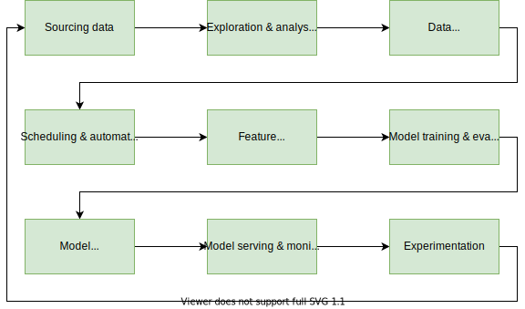
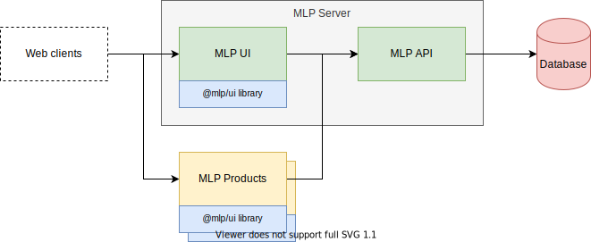

# Machine Learning Platform

Machine Learning Platform (MLP) is a unified set of products for developing and operating the machine learning systems at the various stages of machine learning life cycle. The typical ML life cycle can be viewed through the following nine stages:



MLP Products are systems and services that are specifically built to solve one or multiple stages of the machine learning life cycle's problems. Currently, we have published the following MLP products:

* [**Feast**](https://github.com/gojek/feast) - For managing and serving machine learning features.
* [**Merlin**](https://github.com/gojek/merlin) - For deploying, serving, and monitoring machine learning models.
* [**Turing**](https://github.com/gojek/turing) - For designing, deploying, and evaluating machine learning experiments.

## Architecture overview



The MLP Server provides REST API used across MLP Products. It exposes a shared concepts such as [ML Project](./docs/concepts.md#ml-project). This repository also hosts [Go](./api/pkg) and React ([@gojek/mlp-ui](./ui/packages/lib)) libraries used to build a common MLP functionailty.

## Getting started

### Prerequisites

1. [Google Oauth credential](https://developers.google.com/identity/protocols/oauth2/javascript-implicit-flow)

    MLP uses Google Sign-in to authenticate the user to access the API and UI. After you get the client ID, specify it into `OAUTH_CLIENT_ID` in `.env.development` file.

### From Docker Compose

If you already have [Docker](https://docs.docker.com/get-docker/) installed, you can spin up MLP and its dependencies by running:

```shell script
docker-compose up
```

MLP will now be reachable at <http://localhost:8080>.

### From source

To build and run MLP from the source code, you need to have [Go](https://golang.org/doc/install), [Node.js](https://nodejs.org/), and [Yarn](https://yarnpkg.com/) installed. You will also need a running Postgresql database. MLP uses Docker to make the task of setting up databases a little easier. You can run `make local-db` to starting up a Postgres Docker container.

```shell script
mkdir -p $GOPATH/src/github.com/gojek
cd $GOPATH/src/github.com/gojek
git clone git@github.com/gojek/mlp.git mlp
cd mlp
make local-db
make
```

## Documentation

Go to the [docs](/docs) folder for the full documentation and guides.

## React UI development

For more information on building, running, and developing the UI app and library, see the UI's [README.md](ui/README.md).
